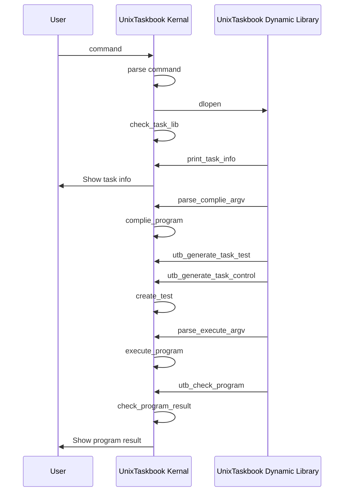

# UnixTaskbook

## Introduction
Задачник реализован на языке C++ для Unix и включает ядро, обеспечивающее основную функциональность задачника, и расширяемый набор динамических библиотек, каждая из которых содержит набор задач по определенной теме.



## Installation
```bash
/bin/bash -c "$(curl -fsSL https://github.com/KCNyu/ UnixTaskbook/releases/download/v1.0.0/install.sh)"
```

## Uninstallation
```bash
/bin/bash -c "$(curl -fsSL https://github.com/KCNyu/ UnixTaskbook/releases/download/v1.0.0/uninstall.sh)"
```

## Task
Текущая версия задачника включает динамические библиотеки с задачами по следующим темам (в скобках указывается количество задач):
* ***[Dir: работа с файловой системой Unix (9)](./docs/Dir/README.md)***
* ***[File: обработка однострочных символьных файлов (17)](./docs/File/README.md)***
* ***[Text: обработка многострочных текстовых файлов (16)](./docs/Text/README.md)***
* ***[Shell: порождение процессов и их взаимодействие (9)](./docs/Shell/README.md)***
* ***[Thread: работа с потоками POSIX thread, их синхронизация (16)](./docs/Thread/README.md)***